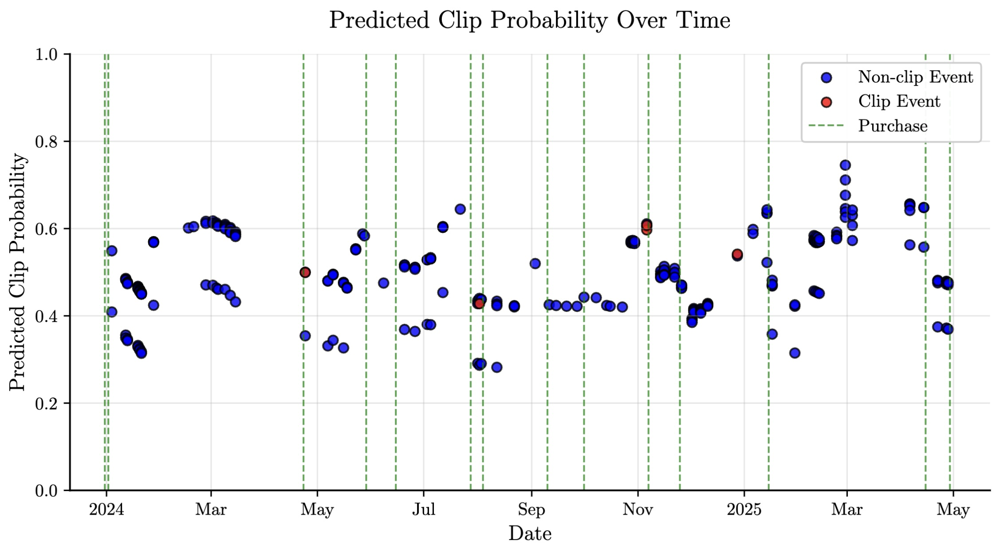
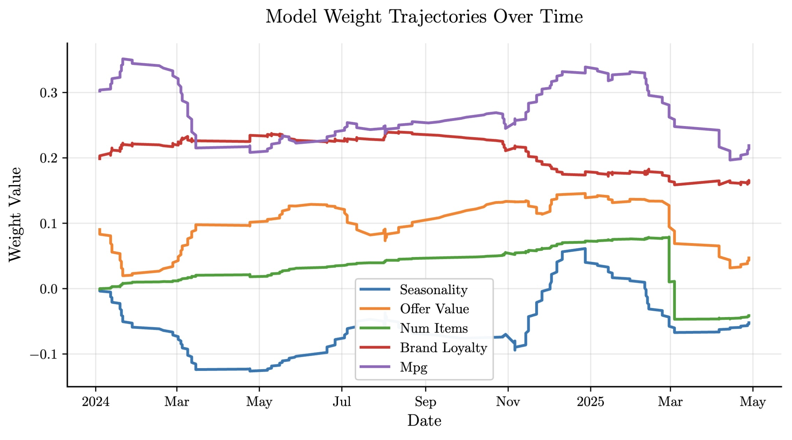

<!-- _paginate: false -->

  <h1>6th International Conference on Data Analytics & Management</h1>
  <h2>(ICDAM-2025)</h2>
  <h3>13th to 15th June 2025</h3>

Scalable and Interpretable Contextual Bandits: A Literature Review and Retail Offer Prototype

Paper ID: 1420

  
Nikola Tanković, Robert Šajina

  
Juraj Dobrila University of Pula Faculty of Informatics 

---

<!-- _footer: "6th International Conference on Data Analytics & Management (ICDAM-2025)" -->

---
<!-- _footer: "6th International Conference on Data Analytics & Management (ICDAM-2025)" -->

# INDEX

- Introduction to Contextual Multi-Armed Bandits (CMABs)
- Challenges & Proposed Approach
- Literature Review: Algorithm Families
- Prototype Scope and Assumptions
- Experiment Design & Workflow
- Results: Interpretability through Weight Trajectories
- Limitations
- Future Work
- Conclusion

---
<!-- _footer: "6th International Conference on Data Analytics & Management (ICDAM-2025)" -->

# Introduction to Contextual Multi-Armed Bandits (CMABs)

- **What are CMABs?**
    - Framework for sequential decision-making under uncertainty where agent learns to select actions (arms) based on observed contextual information 
    - Goal: Maximize cumulative rewards over time 

- **Exploration-Exploitation Dilemma:**
    - Balancing trying new actions to gather information and choosing actions known to yield high rewards 

- **Use Case:** Personalized recommendations in retail offers

- **Motivation for this Paper:**
    - Reviews key aspects of contextual bandits and outlines a prototype system 
    - Prototype designed to explore approaches for addressing challenges such as **interpretability**, **scalability**, and **practical deployment**, particularly in a retail context 

---
<!-- _footer: "6th International Conference on Data Analytics & Management (ICDAM-2025)" -->

# Challenges & Proposed Approach

- **Challenges in Retail Offer Selection:**
    - Addressing the challenge of fast-changing offers over 10M users and 2K categories

- **Proposed Approach Overview:**
    - Model context at the product category level, allowing offers to span multiple categories 
    - Enable knowledge transfer across similar offers 
    - Achieve scalability through efficient feature engineering and modular design 
    - Utilize existing features such as MPG (Member Purchase Gap) and MF (Matrix Factorization) 

- **Key Contribution: Interpretability at Scale:**
    - Logistic regression models yield transparent weight vectors 
    - Accessible via a Large Language Model (LLM) interface for real-time, user-level tracking and explanation of evolving preferences 

---
<!-- _footer: "6th International Conference on Data Analytics & Management (ICDAM-2025)" -->

# Literature Review: Algorithm Families

- **Upper Confidence Bound (UCB) Strategies:**
    - Estimate expected rewards, construct upper confidence bounds (UCBs), and select the arm with the highest UCB 
    - **LinUCB:** Seminal algorithm, models expected rewards as a linear function 
    - **Generalized Linear Models (GLMs):** LogisticUCB developed for binary outcomes 
    - **Neural Network-based UCB:** NeuralUCB leverages deep learning to capture complex non-linear relationships 

- **Epsilon-Greedy ($\epsilon$-Greedy) Methods:**
    - Balances exploration (random action with probability $\epsilon$) and exploitation (highest estimated reward with probability $1-\epsilon$) 
    - Ease of implementation and compatibility with various reward prediction models 

- **Posterior Sampling (Thompson Sampling - TS):**
    - Bayesian approach, maintains a posterior distribution over reward model parameters 
    - Noted for strong empirical performance, often outperforming UCB methods 

---
<!-- _footer: "6th International Conference on Data Analytics & Management (ICDAM-2025)" -->

# Prototype Scope and Assumptions

- **Model Used:** Online logistic regression with stochastic gradient descent (SGD) for binary outcomes 
    - $P(y=1|x;w)=\sigma(w^{I}x)$, where $\sigma(z)=\frac{1}{1+e^{-z}}$ 
- **Context Features ($x_{t,a}$):**
    - Pre-defined user/item characteristics from upstream models
    - Examples: Member Purchase Gap (MPG), brand loyalty, seasonality, offer recency/duration, discount value, and matrix factorization (MF) scores as a bias 
    - Does *not* use learned latent representations or dynamic feature adaptation 
- **Online Weight Updates:**
    - SGD: $w\leftarrow w+\eta(y-\sigma(w^{T}x))x,$, optional boost $\alpha>1$ for positive samples 
    - Weights initialized using domain knowledge (or zeros) and backfitted on historical data 
- **Key Feature: Interpretability via LLMs:**
    - Tracking member-specific weight trajectories over time 
    - Accessible to Large Language Models (LLMs) for generating user-level explanations and behavioral personas 
- **Exploration Strategy:** Randomized scoring via Beta distributions 
    - $\tilde{p}_{o,m}\sim Beta(\kappa p_{o,m},\kappa(1-p_{o,m}))$, where $\kappa$ can increase to reduce exploration over time 

---
<!-- _footer: "6th International Conference on Data Analytics & Management (ICDAM-2025)" -->

# Experiment Design & Workflow

- **Experimental Setup:**
    - Contextual bandit model with logistic regression and stochastic gradient descent (SGD) for online learning 
    - Processes real retail transaction logs to predict offer clip probabilities 
    - Simulates a coupon gallery where users receive offers described by features like MPG, brand loyalty, seasonality, etc. 

- **Two-Level Approach:**
    - Category-level logistic regression models predict clip probabilities 
    - Probabilities are then aggregated to the offer level 

- **Data Preprocessing:** All features are z-score normalized 

- **Learning Process:**
    - CAMB algorithm first batch-trained on historical data (PySpark) 
    - Then learns online via SGD (also PySpark)

---
<!-- _footer: "6th International Conference on Data Analytics & Management (ICDAM-2025)" -->

# Results: Interpretability through Weight Trajectories

- **Visualizations:**
    - Model weight trajectories over time
        - Shows how different features' influence evolves during the simulation 

- **AI-Generated Member Profiles (Example from LLM analysis):**
    - **Overall Profile:** "Overall, this is a brand-loyal, non-seasonal member whose clip behavior is timed around replenishment cycles and increasingly influenced by offer size rather than pure discount depth." 

- **Benefit:** Such AI-generated interpretations enable personalized offer optimization via gallery headlines and email campaigns.

---
<!-- _footer: "6th International Conference on Data Analytics & Management (ICDAM-2025)" -->

---
<!-- _footer: "6th International Conference on Data Analytics & Management (ICDAM-2025)" -->

---
<!-- _footer: "6th International Conference on Data Analytics & Management (ICDAM-2025)" -->

# Limitations

- **Operational Viability (Production Scale) ongoing**

- **Performance Benchmarking**

- **Feature Utility & Assumptions:**
    - Empirical utility of current features (e.g., MPG, MF scores) under real-world distribution shifts requires further validation 
    - Assumption of stable conditions requires further validation, particularly for dynamic settings 

- **Interpretability Evaluation:**
    - Practical benefits of interpretability from model outputs like weight trajectories need formal user evaluation 

---
<!-- _footer: "6th International Conference on Data Analytics & Management (ICDAM-2025)" -->

# Future Work

- **Empirical Validation:**
    - Prioritize empirical validation via A/B tests and offline replay 

- **Feature Representation:**
    - Developing richer, yet interpretable, feature representations (e.g., deep embeddings, hybrid models) 

- **Temporal Adaptation:**
    - Incorporating temporal adaptation mechanisms (e.g., D-LinUCB variants) to handle non-stationarity 

- **Exploration Strategies:**
    - Exploring theoretically grounded exploration strategies 

- **Multi-objective Optimization:**
    - Supporting multi-objective reward functions like long-term customer value, revenue or customer engagement

---
<!-- _footer: "6th International Conference on Data Analytics & Management (ICDAM-2025)" -->

# Conclusion

- **Dynamic Field:** The field of contextual bandits is dynamic and rapidly advancing, expanding algorithmic sophistication, theoretical insight, and real-world applicability 
- **Foundational Algorithms:** LinUCB, Epsilon-Greedy, and Thompson Sampling, with linear and logistic regression models, provide essential underpinnings 
- **Our Prototype's Contribution:**
    - Demonstrates a scalable and interpretable contextual bandit framework for billions of users category pairs aggregated to offer level
    - Leverages logistic regression with static features in a stationary environment 
    - Crucially, exposes model weights in a form that can be directly interpreted by LLMs for transparent, user-level explanations 
- **Significance:** Offers a controlled environment for investigating bandit behavior, while also highlighting the potential for interpretable, AI-powered personalization at production scale.
- **Next Steps:** Substantial empirical and technical refinement is necessary.

---
<!-- _footer: "6th International Conference on Data Analytics & Management (ICDAM-2025)" -->

# Acknowledgments

This research is (partly) supported by:

- European Digital Innovation Hub Adriatic Croatia (EDIH Adria) (project no. 101083838)
- INFOBIP Konverzacijski Order Management (IP.1.1.03.0120)
- Projektiranje i razvoj nove generacije laboratorijskog informacijskog sustava (iLIS) (IP.1.1.03.0158)
- FIPU project on decentralized business process modeling

---

<!-- _footer: "6th International Conference on Data Analytics & Management (ICDAM-2025)" -->

